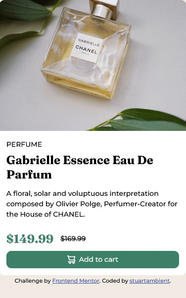

# Frontend Mentor - Product preview card component solution

This is a solution to the [Product preview card component challenge on Frontend Mentor](https://www.frontendmentor.io/challenges/product-preview-card-component-GO7UmttRfa). Frontend Mentor challenges help you improve your coding skills by building realistic projects.

## Table of contents

- [Overview](#overview)
  - [The challenge](#the-challenge)
  - [Screenshot](#screenshot)
  - [Links](#links)
- [My process](#my-process)
  - [Built with](#built-with)
  - [What I learned](#what-i-learned)
  - [Continued development](#continued-development)
- [Author](#author)

**Note: Delete this note and update the table of contents based on what sections you keep.**

## Overview

### The challenge

Users should be able to:

- View the optimal layout depending on their device's screen size
- See hover and focus states for interactive elements

### Screenshot

### Links

- Solution URL: [Add solution URL here](https://github.com/stuartambient/Product-Preview-Card-Component)
- Live Site URL: [Add live site URL here](https://stuartambient.github.io/Product-Preview-Card-Component/)

## My process

Not sure I had a process to start except choosing what I considered basic enough to get my feet wet. I already have some html and css knowledge. I created a local project and tested and tweaked mostly.

### Built with

- Semantic HTML5 markup
- CSS custom properties
- Flexbox

### What I learned

- Using more of flexbox, including spending some time reading up on the flex shorhand (grow, shrink and basis)

- Responsive design - particularly writing media queries.

- Responsive images - After seeing someone else's code I decided to try and use srcset along with the 'sizes' property. It was probably overkill for this challenge it was a good thing to learn for the future.

- I also read up on how to reset the CSS from the default browser styles.

- I tried to use all classes going for low specificity CSS. I used some basic BEM to name the classes. Think I need more practice in this area.

### Continued development

Just more css design in general.

## Author

- Frontend Mentor - [@stuartambient](https://www.frontendmentor.io/profile/stuartambient)
